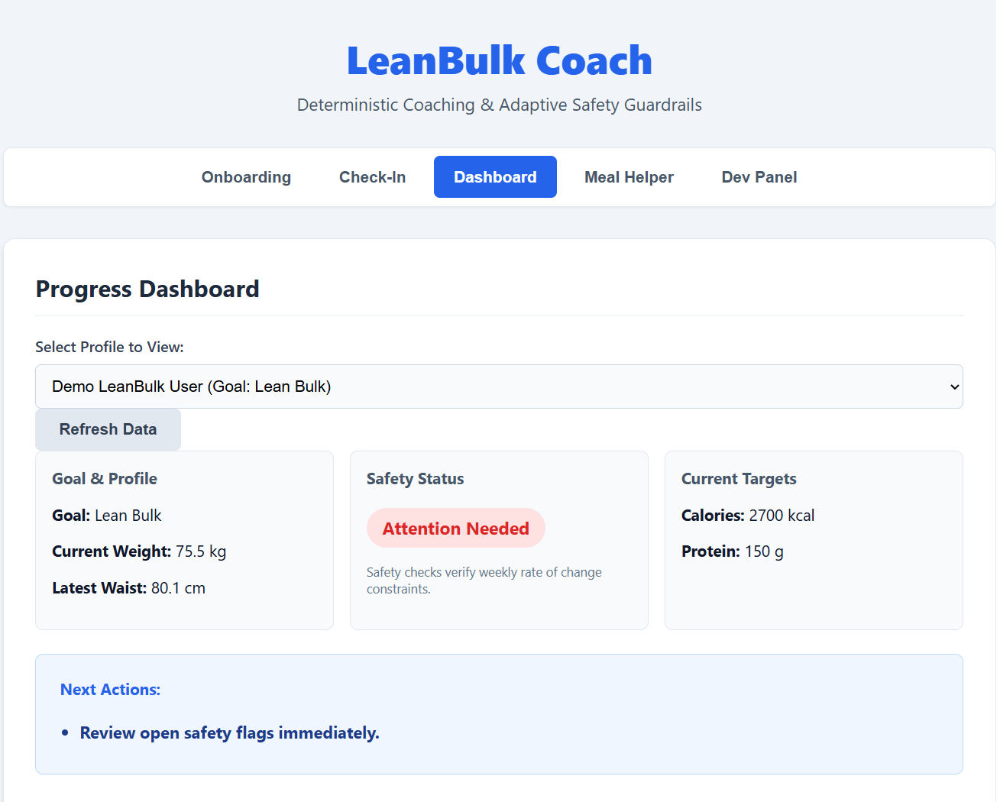
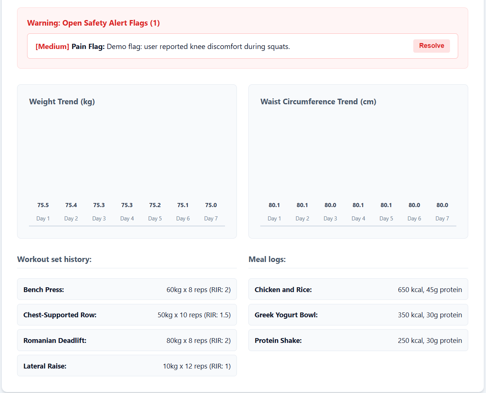
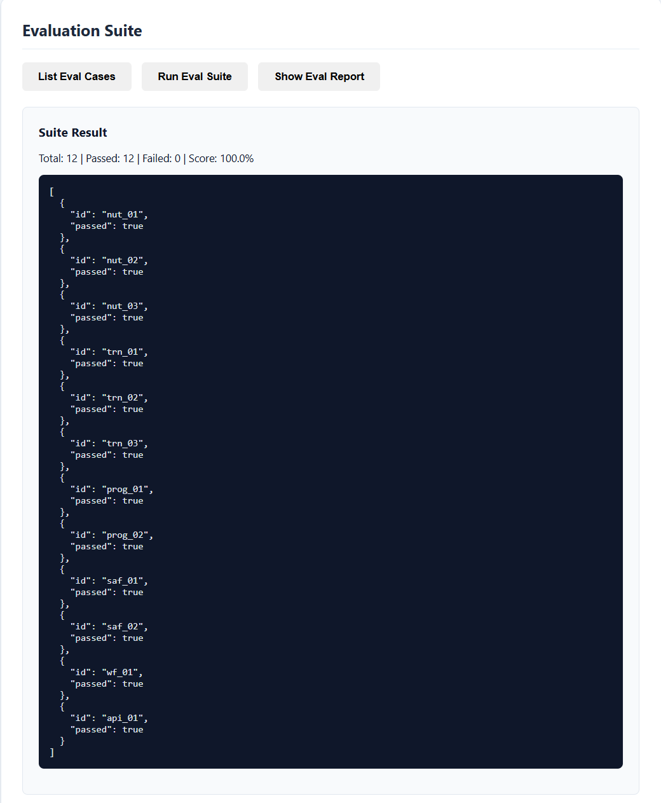
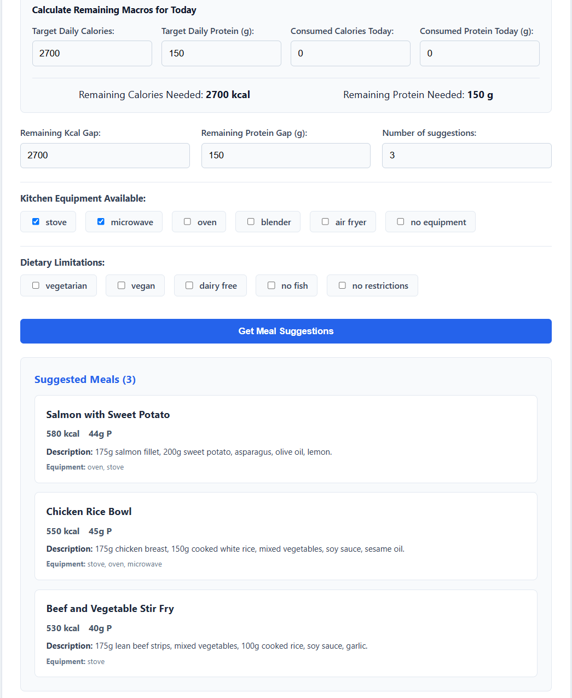
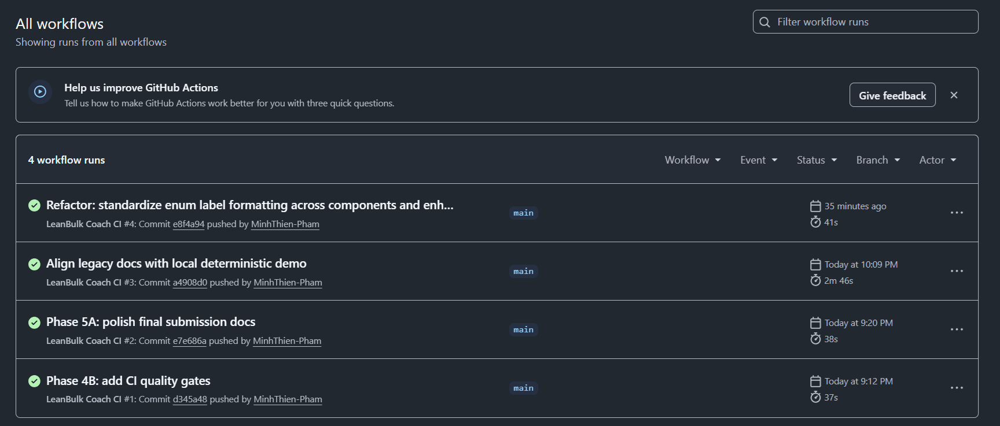

# LeanBulk Coach

[](https://github.com/MinhThien-Pham/leanbulk-coach/actions/workflows/ci.yml)

LeanBulk Coach is an offline-first, safety-oriented coaching assistant designed to guide skinny-fat beginners through body recomposition. By leveraging deterministic logic, local SQLite persistence, FastAPI, and a React frontend, it calculates nutritional targets, monitors weight trends, and flags physical pain signals—offering structured, rule-based feedback without requiring live LLM calls, external APIs, or billing accounts.

---

## The Problem

Skinny-fat beginners start with excess body fat and minimal muscle mass, making typical bulk/cut advice confusing and counterproductive. They need highly personalized, weekly adaptivity that balances safety limits and adherence. LeanBulk Coach improves safety through rule-based guardrails, replacing unpredictable LLM recommendations with a robust, deterministic coaching workflow.

---

## Core Features

- **Deterministic Calculators:** Precise, side-effect-free math formulas for calorie maintenance, surpluses, deficits, and protein targets.
- **SQLite Persistence:** Async database operations storing user profiles, bodyweight metrics, workout set history, meal macros, and active safety alerts.
- **FastAPI Backend:** Clean, local-only routes mapping persisting inputs, context assemblers, and evaluation runner tasks.
- **React Frontend:** A tabbed, plain-ASCII dashboard supporting intake forms, check-ins, custom CSS trend charts (no external library dependencies), and a meal suggestion helper.
- **MCP Context Server:** Read-only Model Context Protocol context layer exposing profile, body, nutrition, workout, meal, safety, and progress context.
- **ADK Agent Configuration:** Built-in ADK configuration templates defining root and sub-agent roles.
- **Deterministic Eval Suite:** 12 check-in scenario integration tests verifying progress rules and safety overrides (100% pass score).
- **Demo Seed Workflow:** Create a complete, realistic historical profile with one click to test the full dashboard features instantly.
- **Local Docker Compose:** Spin up the complete frontend, database, and backend service stack with a single command.
- **GitHub Actions CI:** Quality gate checking unit tests, statement coverage, evaluation score, frontend compilation, and compose setup validation.

---

## Architecture at a Glance

```
  +-------------------------------------------------------+
  |                    React Frontend                     |
  | (Onboarding, Check-In, Dashboard, Meal Helper, Evals) |
  +-------------------------------------------------------+
                              |
                         (HTTP APIs)
                              v
  +-------------------------------------------------------+
  |                      FastAPI API                      |
  |     (/profiles, /logs, /context, /summary, /seed)     |
  +-------------------------------------------------------+
                              |
            +-----------------+-----------------+
            v                                   v
  +-------------------+               +-------------------+
  |    MCP Server     |               |  Coaching Rules   |
  |  (Read-only       |               | & Workflows (Seed |
  |   context tools)  |               |  data, evals)     |
  +-------------------+               +-------------------+
            |                                   |
            v                                   v
  +-------------------+               +-------------------+
  |  SQLite Database  |               |  Deterministic    |
  | (SQLAlchemy/Async)|               |    Math Tools     |
  +-------------------+               +-------------------+
```

---

## Quick Start (Docker Compose)

Review the full application in under 2 minutes:
```bash
docker compose up --build
```
Once started:
- **Frontend Dashboard:** [http://localhost:5173](http://localhost:5173)
- **Backend Health Check:** [http://localhost:8000/health](http://localhost:8000/health)

1. Open the frontend and select the **Onboarding** tab.
2. Click **Create Demo Profile** to seed a complete mock history.
3. Explore the populated charts and resolve safety flags in the **Dashboard**!

*Note: The Docker Compose configuration is for local demo and evaluation purposes only, not production deployment.*

---

## Demo Video

Watch the project walkthrough: [LeanBulk Coach Demo](https://www.youtube.com/watch?v=xdDQN0ny-0w)

## Demo Screenshots

### Local Demo Dashboard



### Safety Guardrail



### Evaluation Suite



### Meal Helper



### CI Quality Gates



---

## Manual Local Development

### 1. Backend Setup
Activate your virtual environment and install requirements:
```bash
pip install -r backend/requirements.txt
uvicorn backend.app.main:app --reload
```
The local API is served at `http://localhost:8000`. Open `/docs` for the interactive Swagger UI.

### 2. Frontend Setup
Navigate to the frontend folder, install packages, and spin up the Vite development server:
```bash
cd frontend
npm install
npm run dev
```
Open [http://localhost:5173](http://localhost:5173) in your browser.

---

## Verification Commands

To run all backend tests, coverage, and compilation builds:
```bash
# Run backend tests
pytest --tb=short -q

# Run coverage report
pytest --cov=backend/tools --cov=backend/db --cov=backend/agents --cov=backend/mcp_server --cov=backend/workflows --cov=backend/app --cov=backend/evals --cov-report=term-missing -q

# Run evaluation runner CLI
python -m backend.evals.runner

# Build frontend production bundle
cd frontend && npm run build

# Validate Docker Compose configuration
docker compose config
docker compose build
```

---

## Safety & Limitations

- **Not Medical Advice:** LeanBulk Coach provides general guidance. It includes strict guardrails that restrict calorie targets, warn against waist creep, and log safety flags during knee pain symptoms.
- **Offline & No Auth:** This MVP focuses strictly on local demonstration; there is no security auth layer or production cloud deployment config.
- **No Live LLM Required:** All calculations and decision metrics run offline using deterministic tools, enforcing deterministic guardrails against model hallucinations.

---

## Repository Structure

```
leanbulk-coach/
├── .github/workflows/ci.yml           # GitHub Actions CI workflow
├── backend/
│   ├── agents/                        # ADK agent configurations and Tool registry
│   ├── app/                           # FastAPI routers, schemas, and API lifespans
│   ├── db/                            # SQLAlchemy models, SQLite session makers, repositories
│   ├── evals/                         # Deterministic eval runner, case specs, reporting
│   ├── mcp_server/                    # Read-only Model Context Protocol router and server
│   ├── tools/                         # Pure deterministic functions (calorie/safety/trend math)
│   └── workflows/                     # Local demo flow and demo seeding workflows
├── docs/                              # Project documentation
│   ├── API_EXAMPLES.md                # Endpoint cURL examples
│   ├── ARCHITECTURE_OVERVIEW.md       # Detailed system design
│   ├── DEMO_GUIDE.md                  # Step-by-step 2-minute review walkthrough
│   └── TROUBLESHOOTING.md             # Common setup issue fixes
├── frontend/                          # React + Vite application
│   ├── src/
│   │   ├── api/                       # API fetch client
│   │   └── components/                # Onboarding, check-in, dashboard panels
│   └── index.html                     # HTML root template
├── specs/                             # Product and architecture specifications
│   ├── DEMO_SCRIPT.md                 # Detailed demonstration steps
│   └── SECURITY_GUARDRAILS.md         # Safety constraints reference
├── Dockerfile.backend                 # Backend service image manifest
├── Dockerfile.frontend                # Frontend service image manifest
└── docker-compose.yml                 # Local dev stack orchestration manifest
```

---

## Documentation Links

For deeper evaluation, please check the following documents:
- [Demo Guide](docs/DEMO_GUIDE.md) - Complete walkthrough steps
- [API Examples](docs/API_EXAMPLES.md) - cURL payloads reference
- [Architecture Overview](docs/ARCHITECTURE_OVERVIEW.md) - Component design details
- [Troubleshooting Guide](docs/TROUBLESHOOTING.md) - Common port or configuration fixes
